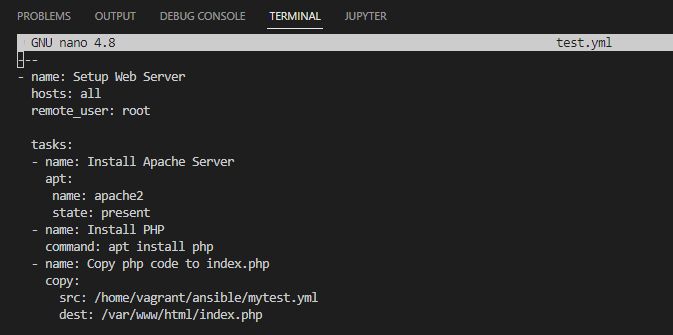
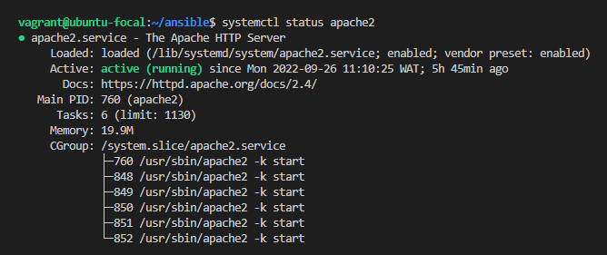
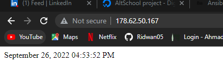

# Ansible Exercise

## In the exercise I created an Ansible Playbook to setup a server with Apache. The server was set to Africa/Lagos Timezone and an index.php file is hosted as the main file.

### See results below
- Playbook   
   

- Apache Server Status  
    

- Rendered Page  
    
