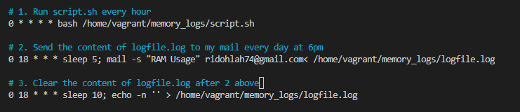

# Cronjob Exercise

## In the exercise I created a bash script to run at every hour, saving system memory (RAM) usage to a specified file and at 6pm everyday, it sends the content of the file to my email address, clear the content of the file, then starts over.

### I created a _script.sh_ file that creat a file _logfile.log_ which saves RAM usage.  
   

### I scheduled 3 Cronjobs
 1. `0 * * * * bash /home/vagrant/memory_logs/script.sh` to run the script every hour  
 2. `0 18 * * * sleep 5; mail -s "RAM Usage" ridohlah74@gmail.com< /home/vagrant/memory_logs/logfile.log` to send the content of _logfile.log_ to my mail at 6pm everyday. `sleep 5` will delayed the command for 5 seconds.
 3. `0 18 * * * sleep 10 echo -n '' > /home/vagrant/memory_logs/logfile.log` to clear the content of _logfile.log_ at 6pm. `sleep 10` will delayed the command for 10 seconds.  
   

### Here is the mail sent at 6pm

   