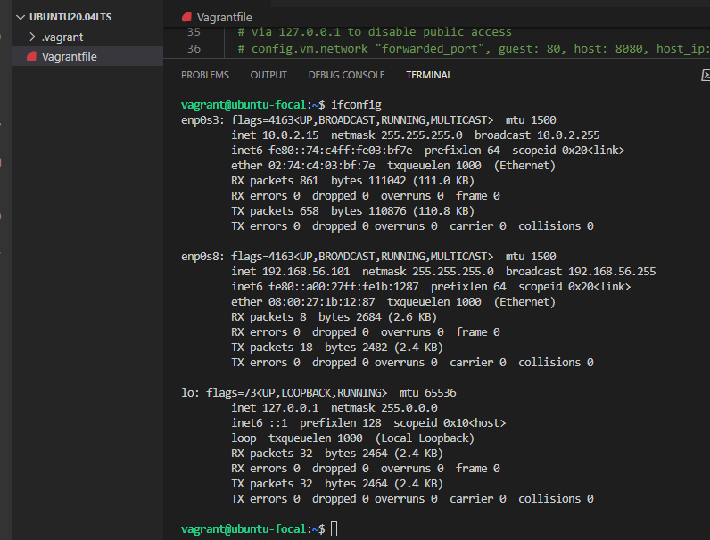

# Exercise 1

## In this exercise, I installed Ubuntu 20.04 LTS using Vagrant
`cd` into vagrant folder 
Ran `vagrant init hashicorp/bionic64` to initialize virtualbox
Ran `vagrant up` to spin up the VM
Ran `vagrant ssh` to login to the VM

## Customized the Vagrantfile with private_network set to dhcp
Add `config.vm.network "private_network", type: "dhcp"` to the Vagrantfile
Ran `ifconfig`
Here is the output
