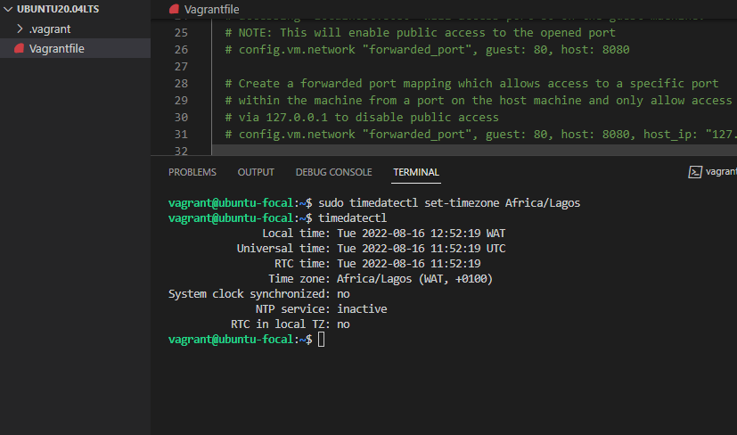

# Exercise 2

## In this exercise, I changed my time zone to Africa/Lagos
- `cd` into vagrant folder
- Ran `sudo timedatectl set-timezone Africa/Lagos` to set timezone
- Ran `timedatectl` to display timezone

- Here is the output

