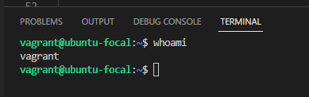
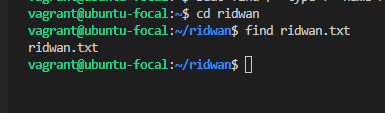
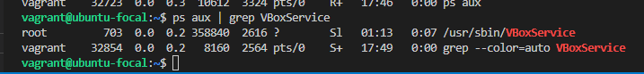
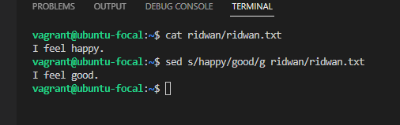
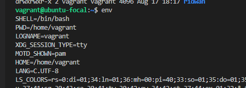
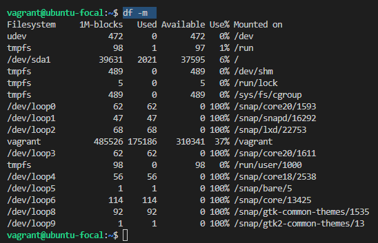
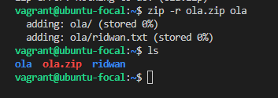
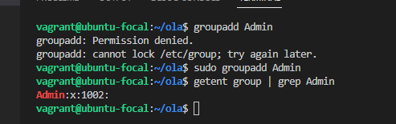
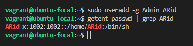
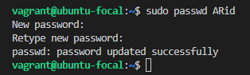

# Exercise 3

## In this exercise, I used 10 linux commands
1. `whoami` to check which user I logged in as.  
    

2. `find` to check or find a directory or file in a directory  

    

3. `grep` is a filtering command  

      
    In this command `ps aux` get all processes running on my machine, `|` piped the result to `grep` which filtered it and return processes related to _VboxService_

4. `sed` is use to find and replace a word or text pattern in file  

      
    `s` command performs the search: the term _(happy)_ I'm searching for comes first, follow by the term _(good)_ I want to replace it with (happy), separated by a slash (/). The g command tells Linux that I want the replacement performed globally.

5. `env` to display my environment variables  

    

6. `df -m` to get a report on my system’s disk space usage  

    

7. `zip -r` to compress a folder to zip file  

    

8. `groupadd` to create a new group  

      
    `sudo groupadd Admin` added a new group named _Admin_, `getent group` get a list of all groups and piped `|` it to `grep` which filtered the list for _Admin_

9. `useradd` to add a new user  

      
    `sudo useradd ARid` added a new user _ARid_

10. `passwd` to create password for a user  

     