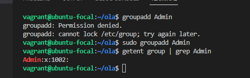
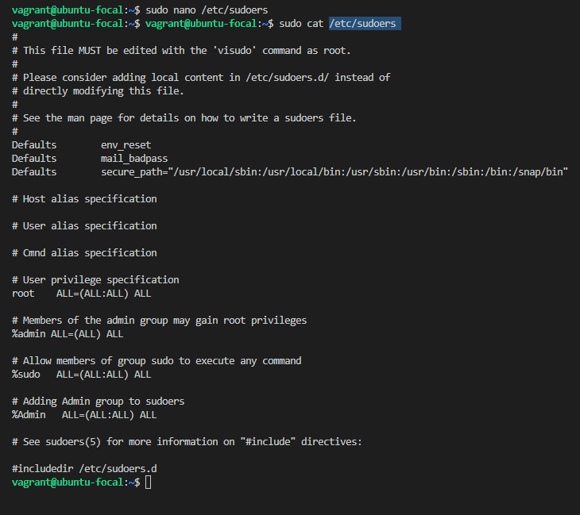
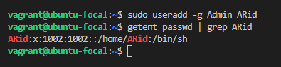
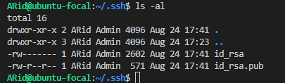
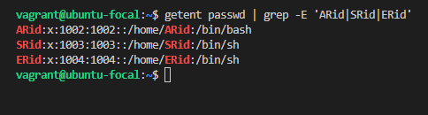
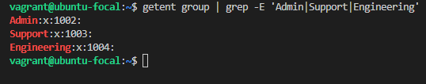

# Exercise 4

## Created 3 groups – Admin, Support & Engineering and added the Admin group to sudoers
- I Used `sudo groupadd Admin` to create ~Admin~ group 
  
  `sudo groupadd Support` and `sudo groupadd Engineering` were used to create ~Support~ and ~Engineering~ group respectively.  
- I used `nano /etc/sudoers` to edit the content of /etc/sudoers
- added ~Admin~ group to sudoers by adding ~%Admin ALL=(ALL:ALL) ALL~ to content of /etc/sudoers
   

## Created a user in each of the groups.
I Used `sudo useradd -g Admin ARid` to create user ~ARid~ in the ~Admin~ group
  
  `sudo useradd -g Support SRid` and `sudo useradd -g Engineering ERid` were used to create user ~SRid~ and user ~ERid~ in ~Support~ and ~Engineering~ group respectively.  

## Generated SSH keys for the user in the Admin group
- I used `su ARid` to switched to user ~ARid~
- `cd` to /home/ARid  
- created ~.ssh~ file
- generated ssh key with `ssh-keygen` and saved in the default folder ~/home/ARid/.ssh/id_rsa~
   

## Contents of /etc/passwd
   

## Contents of /etc/passwd
   
