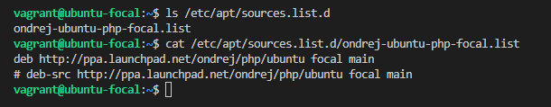
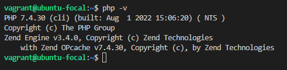

# Exercise 5

## In this exercise, I installed PHP 7.4 on my local linux machine using the ppa:ondrej/php package repo.
- `sudo add-apt-repository ppa:ondrej/php` to installed the php repo _(ppa:ondrej/php)_
- `cat /etc/apt/sources.list.d/ondrej-ubuntu-php-focal.list` to view my new repo  

     
- `sudo apt -y install php7.4` to install PHP 7.4
- `php -v` to check the php version
   