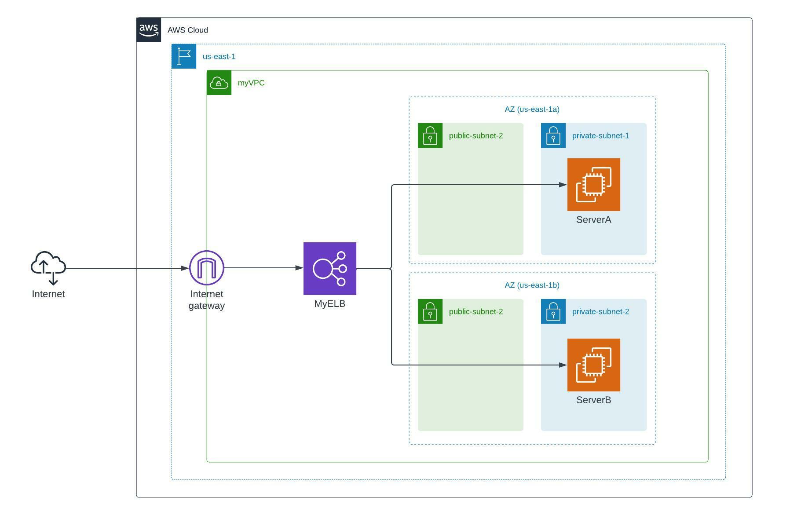
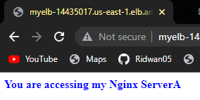
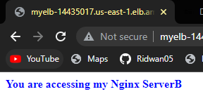

# Holiday Challenge

## In this exercise, I deployed two EC2 instances without public IP address in private subnet in different AZs and make them accesible only through a load balancer on AWS  
  

### Prerequisites
- AWS account
- VPC
- 4 subnets, a pair of private and public subnet in two different AZs.
- internet gateway
- Elastic IP
- 2 security groups, one for the EC2s and one for Loadbalancer (ALB)
- Route table

### Steps
- Launch one EC2 (Ubuntu 20.04) without public IP in each private subnet.
- Create a route table with the internet gateway and associate the public subnets with it.
- Make the private subnets public by adding internet gateway to the main route table of the VPC and associate them with it.
- Attach the elastic IP to one EC2, connect to it, install Nginx and program the Nginx server to display hostname instead of Nginx default page, test the server in the browser, then detach the elastic IP.
- Repeat the previous step for the second EC2.
- Delete the elastic IP and remove internet gateway from the main route table of the VPC
- Create a Target group for the loadbalancer using the EC2s as target
- Create loadbalancer and select the 2 AZs and the 2 public subnets.
- Configure EC2s security group to accept traffic from the load balancer
- Configure Loadbalancer to accept HTTP traffic
- Test loadbalancer's endpoint

### Test Output  
         
