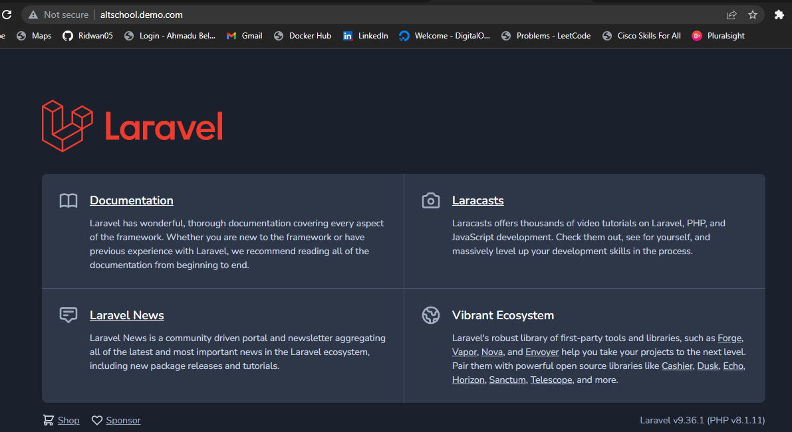

# Laravel Realworld Project

## In this exercise, I cloned a Laravel project and deployed it to Debian 11, running on a virtual machine on Digital Ocean.

- Created Debian 11 droplet with ssh access, on DigitalOcean
       `ssh root@ip...`  
       Created a new group with `sudo groupadd admin`  
       added admin to sudoers
       created user with `useradd -g admin ridwan`  
       change ridwan shell to bash with `usermod --shell /bin/bash ridwan`  
       make home directory for ridwan `mkhomedir_helper ridwan`  
       switched to the new user with `sudo ridwan`

- installed apache
- installed git
- Installed and configured MariaDB, created new password for its root user  
    `sudo apt install mariadb-server`  
    `sudo mysql_secure_installation`  

- install php and required dependencies  

    `sudo apt-get install php8.1 libapache2-mod-php php8.1-dev php8.1-zip php8.1-curl php8.1-mbstring php8.1-mysql php8.1-gd php8.1-xml`

- installed composer with `curl -sS https://getcomposer.org/installer | php`  
    moved composer.phar to /usr/local/bin/composer with  `sudo mv composer.phar /usr/local/bin/composer`  
    cd to /var/www/html
    assigned ownership of the directory to the user with `sudo chown -R $USER /var/www/html`  
    clone Laravel to /var/www/html  
    cd into Laravel

- create a new virtual host file (/etc/apache2/sites-available/Laravel.conf) with the content:  

       ```

       <VirtualHost *:80>
           ServerName altschool.demo
           ServerAdmin ridohlah74@gmail.com
           DocumentRoot /var/www/html/Laravel/public

           <Directory /var/www/html/Laravel>
               AllowOverride All
           </Directory>
           ErrorLog ${APACHE_LOG_DIR}/error.log
           CustomLog ${APACHE_LOG_DIR}/access.log combined
       </VirtualHost>

         ```

- disabled the default site with `sudo a2dissite 000-default.conf`
- enabled the new site with `sudo a2ensite Laravel.conf`
- installed laravel dependencies with `composer install`
- created a database  
    Login as root user `mysql -u root -p`  
    create database with `create database ridwan;`
- copy .env.example to .env with `cp .env.example .env`  
     edit with nano .env file to:  

       ```
          DB_CONNECTION=mysql
          DB_HOST=localhost
          DB_PORT=5432
          DB_DATABASE=ridwan
          DB_USERNAME=root
          DB_PASSWORD=Khadijah74

       ```

- give laravel permision by running the following commands:  
      ```
      
      sudo chown -R :www-data /var/www/html/Laravel

      sudo chmod -R 775 /var/www/html/Laravel

      sudo chmod -R 775 /var/www/html/Laravel/storage

      sudo chmod -R 775 /var/www/html/Laravel/bootstrap/cache

      ```
    
- connect database to laravel:  
      ```

      php artisan key:generate  
      php artisan config:cache  
      php artisan migrate

      ```

- restart apatche with `sudo systemctl restart apache2`
- configured a domain (altschool.demo.com) to point at the remote server IP whenever I visit the domain in my host browser.  
     Did this by adding `68.183.114.0   altschool.demo.com` to my local system hostfile.  

     

- Issues

   - I had issue with missing or incompatible dependencies, so I had to installed all required dependencies.

   - I encountered error 404 in the webpage. I uncomment the function "route", in `routes/web.php` file to fix it.