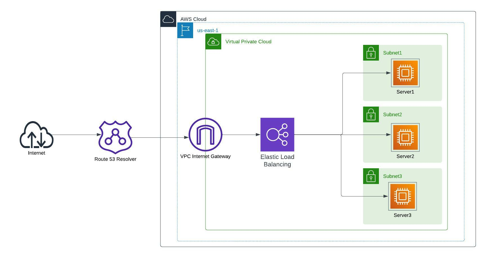

# In this project, I used terraform to create 3 EC2 instances and put them behind an Elastic Load Balancer; Set up a domain with AWS Route53, then add an A record for subdomain terraform-test that points to the ELB.  

## Create an Ansible script to install Apache, set timezone to Africa/Lagos and displays a simple HTML page that displays content to clearly identify on all 3 EC2 instances.